# Bem do Campo 🌱

## 📚 Sobre o Projeto
**Bem do Campo** é um projeto interdisciplinar desenvolvido como parte do curso de Graduação em Desenvolvimento de Software Multiplataforma (DSM) da Fatec Araras. Alinhado aos Objetivos de Desenvolvimento Sustentável (ODS) 2 e 12 da Agenda 2030, nosso objetivo é reduzir o desperdício de alimentos, apoiar práticas agrícolas sustentáveis e fortalecer a segurança alimentar local.

### 🎯 Objetivo
Criar uma plataforma que conecta consumidores e produtores locais para a troca e venda de alimentos e produtos sustentáveis. Promovemos um impacto positivo ao:
- **Minimizar desperdícios** de alimentos.
- **Apoiar práticas agrícolas sustentáveis**.
- **Fortalecer a segurança alimentar** na comunidade.

## 🛠️ Tecnologias e Ferramentas Utilizadas
- **Backend**: Django 5.1.2, MongoEngine, PyMongo.
- **Frontend**: HTML, CSS, JavaScript e Bootstrap 5.3.
- **Banco de Dados**: MongoDB (NoSQL) e MySQL (Relacional).
- **Outras ferramentas**: GitHub para controle de versão e Docker para banco de dados.

## 🧑‍💻 Funcionalidades
- Cadastro de usuários (consumidores e produtores).
- Listagem e busca de produtos por localização e categoria.
- Troca e venda de alimentos de maneira sustentável.
- Sistema de mensagens entre consumidores e produtores.
- Dashboard de impacto, vendas e avaliações.

## ✨ Características do Projeto
- Integra disciplinas acadêmicas como:
  - **Desenvolvimento Web III**.
  - **Gestão Ágil de Projetos de Software**.
  - **Banco de Dados Não Relacional**.
- Enfatiza o crescimento individual e o trabalho em equipe.
- Destaca a importância da documentação de software.

## 📂 Estrutura do Repositório
Este repositório inclui:
- **Código Backend**: Django para APIs e lógica de negócio.
- **Código Frontend**: HTML, CSS e JS.
- **Documentação**: Incluindo arquivos de requisitos, planejamento e diagramação.
- **Banco de Dados**: Scripts e configurações para MongoDB e MySQL.

## 🌍 Alinhamento com os ODS
- **ODS 2 - Fome Zero e Agricultura Sustentável**: Foco na erradicação da fome e no apoio à agricultura sustentável.
- **ODS 12 - Consumo e Produção Responsáveis**: Incentivo a práticas que minimizem o desperdício de recursos.

## 📄 Apresentação
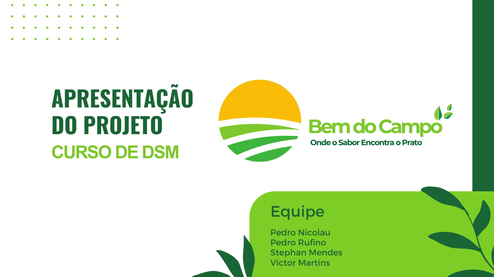
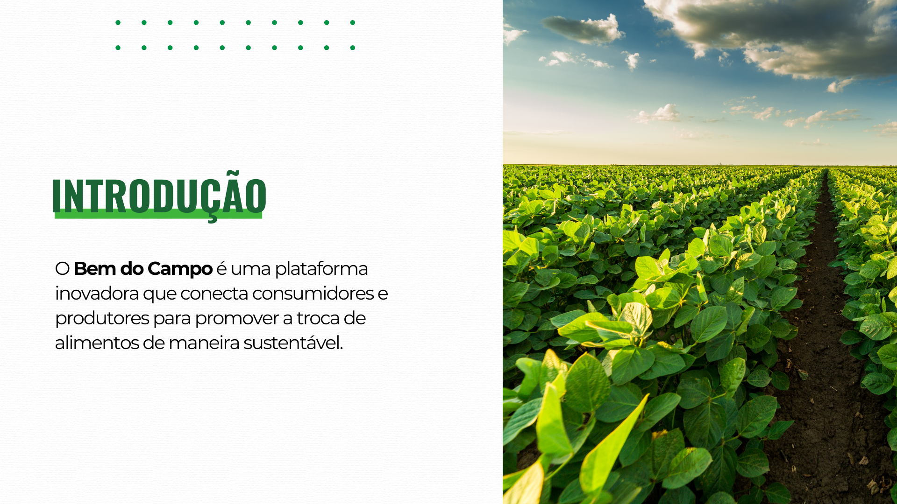
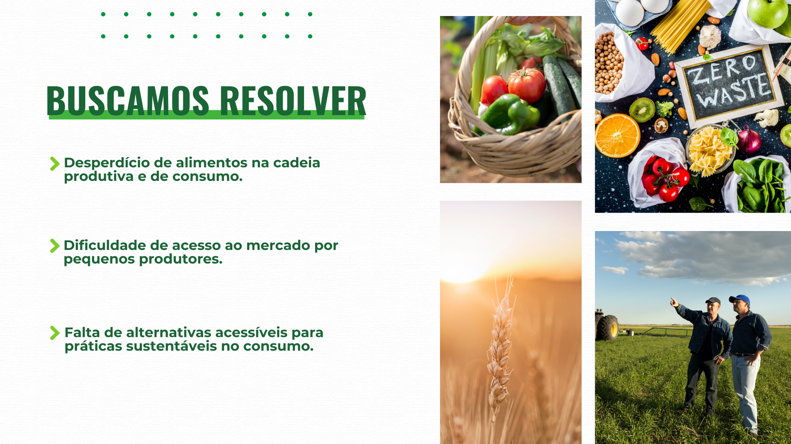
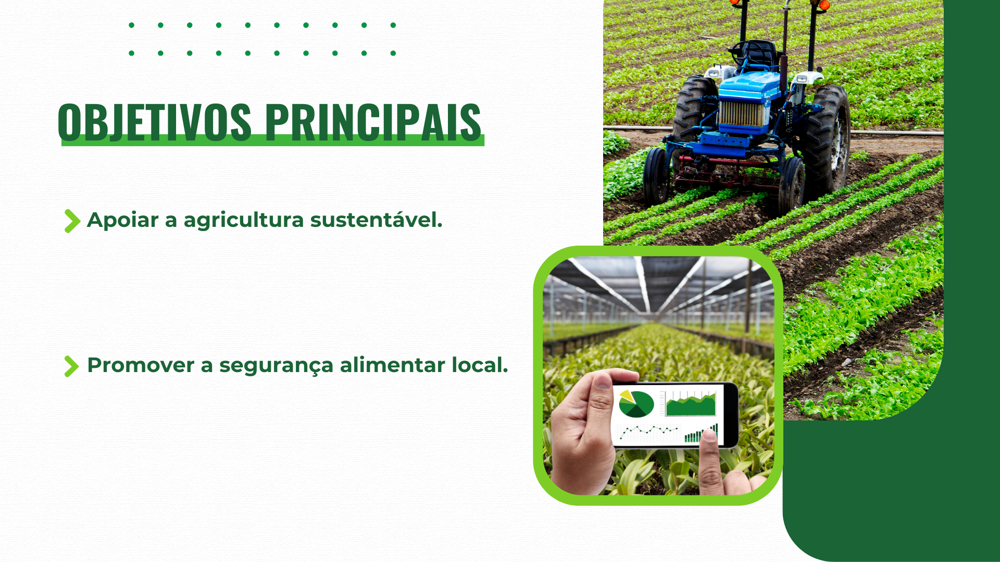
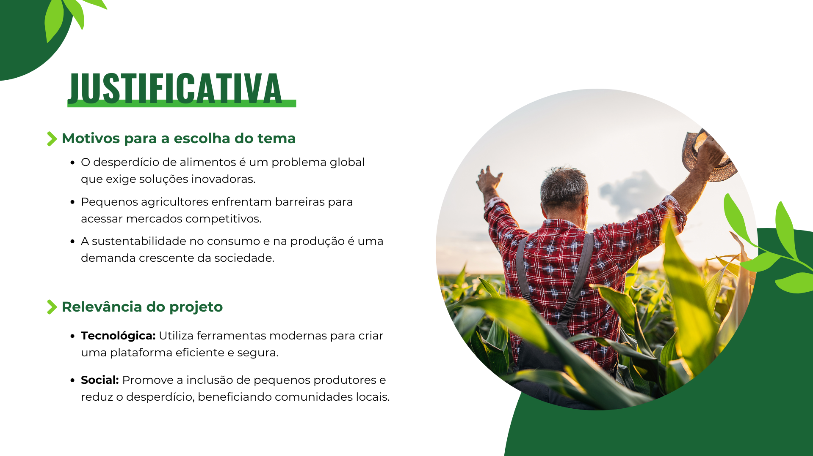
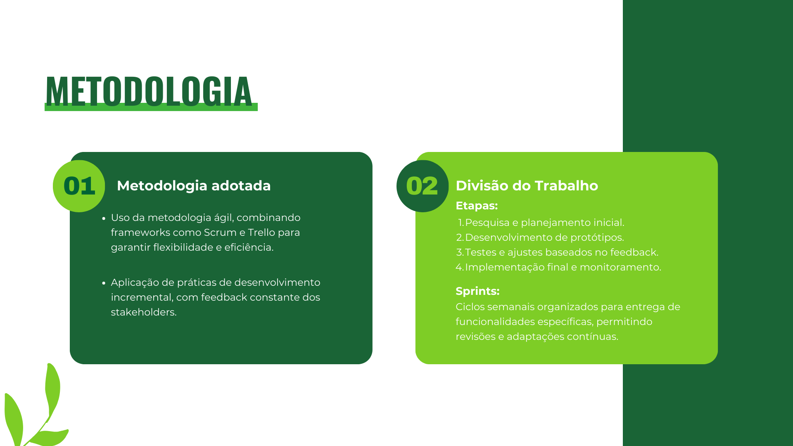
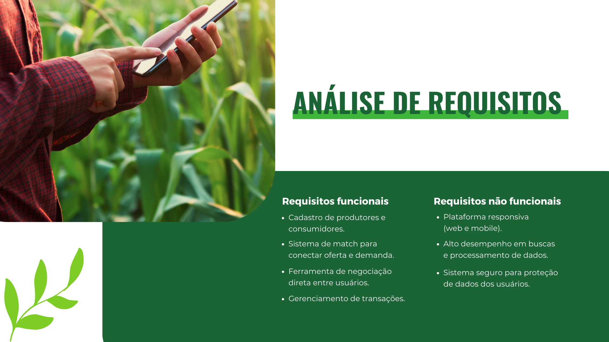
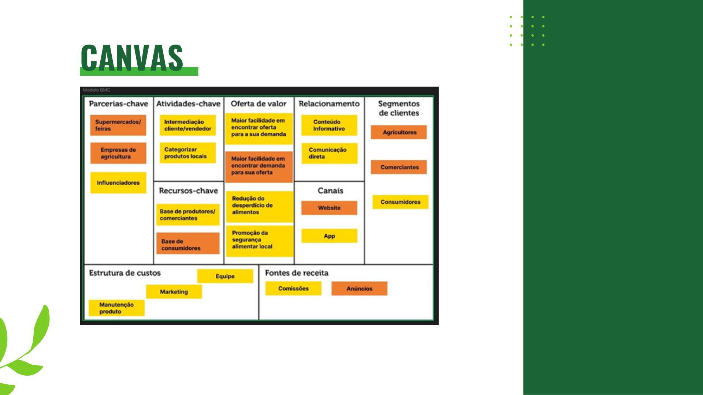
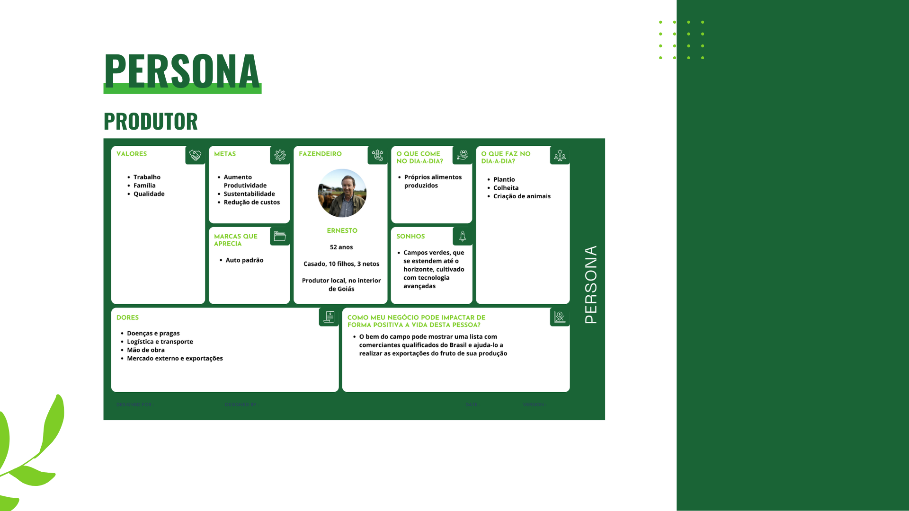
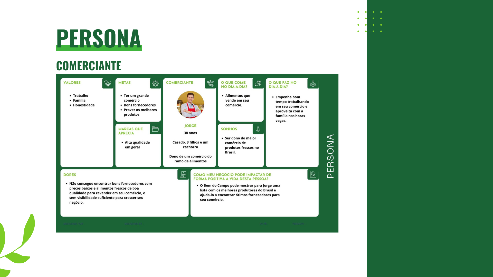
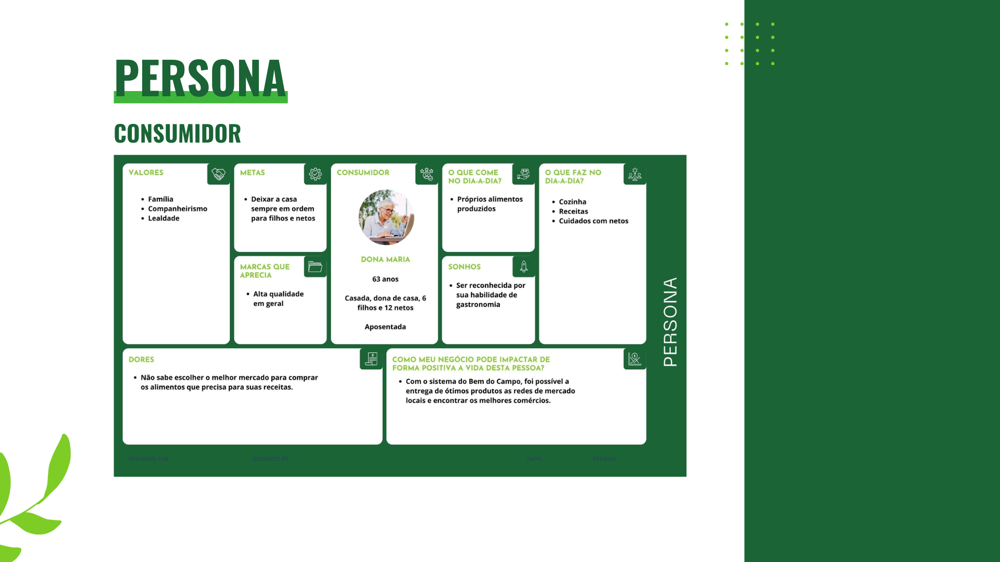
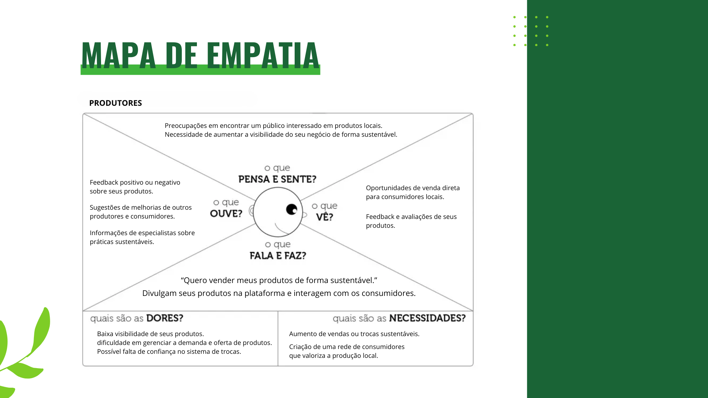
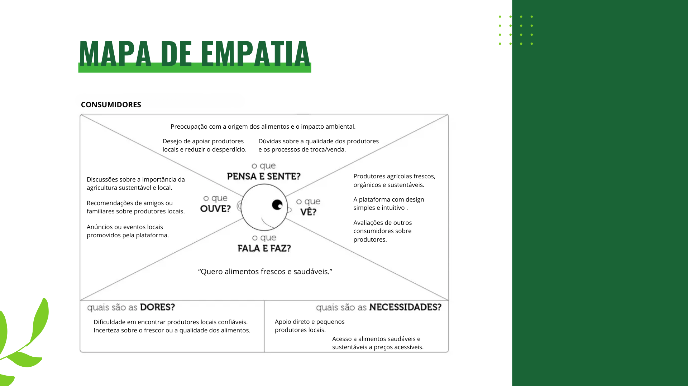
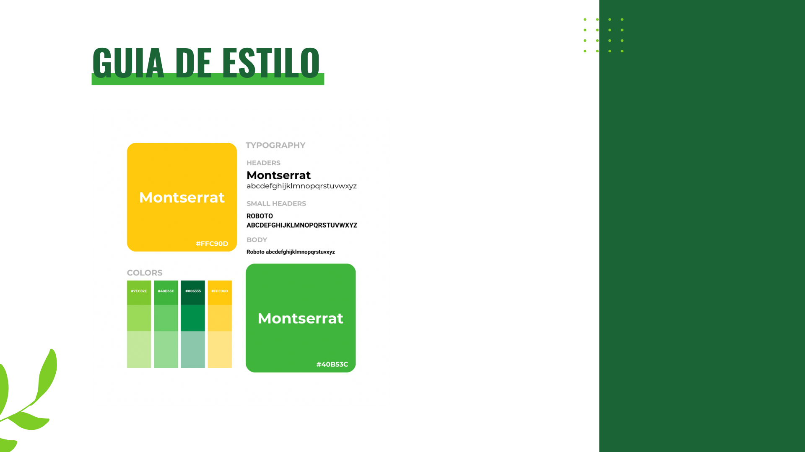
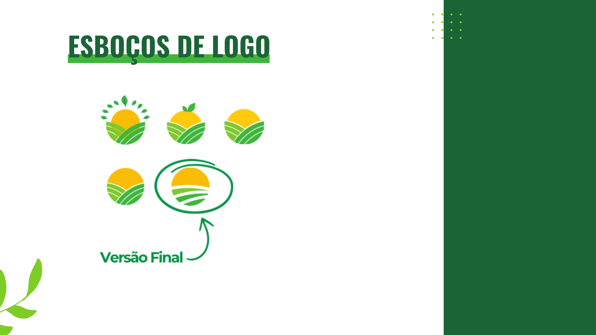
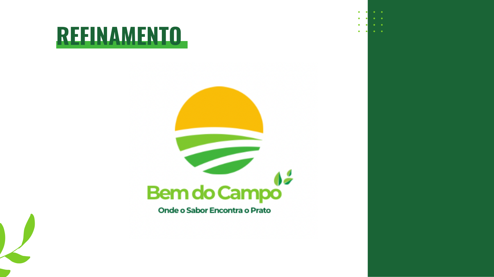
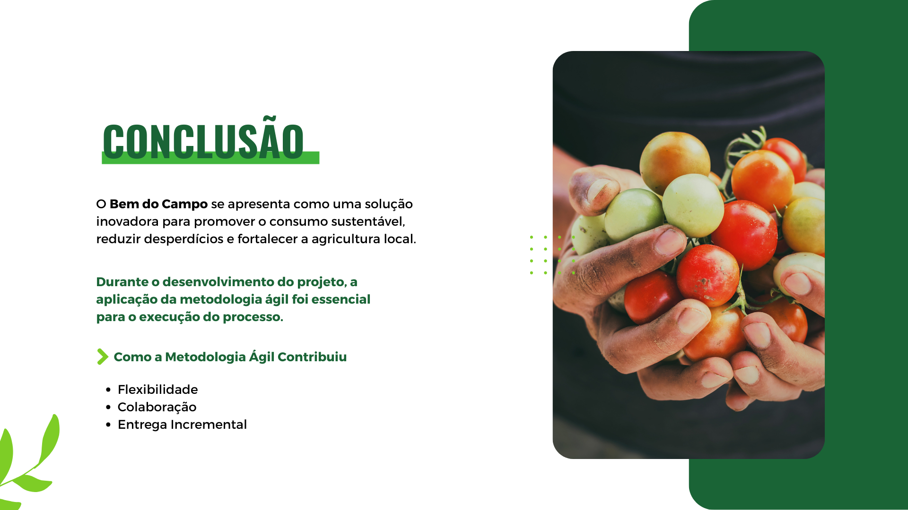

## 👥 Integrantes do Grupo
- [Pedro Rufino da Mata Neto](https://github.com/PedNeto) - Back-End e Front-End.
- [Stephan Mendes de Oliveira](https://github.com/StephanMendes) - Banco de Dados e Front-End.
- [Victor Manoel Martins](https://github.com/heyvitin) - Design e Documentação.
- [Pedro Nicolau](https://github.com/pedromnicolau) - Design e Prototipagem.

---

**Bem do Campo** - Cultivando sustentabilidade, conectando comunidades. 🌍
